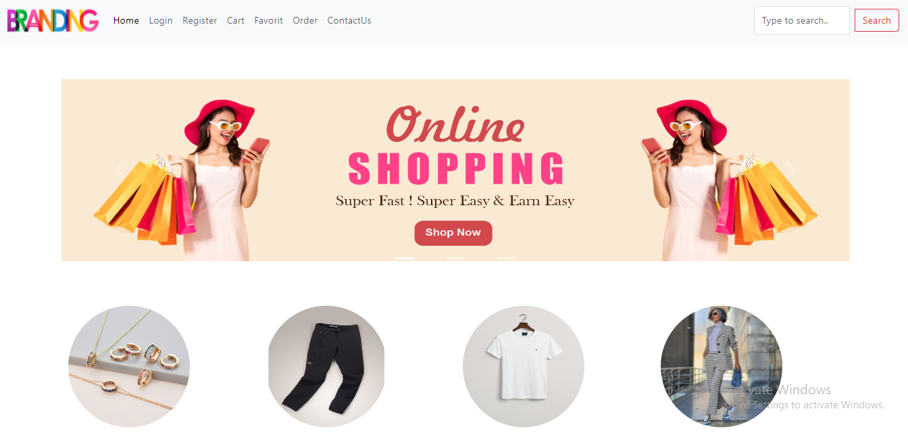
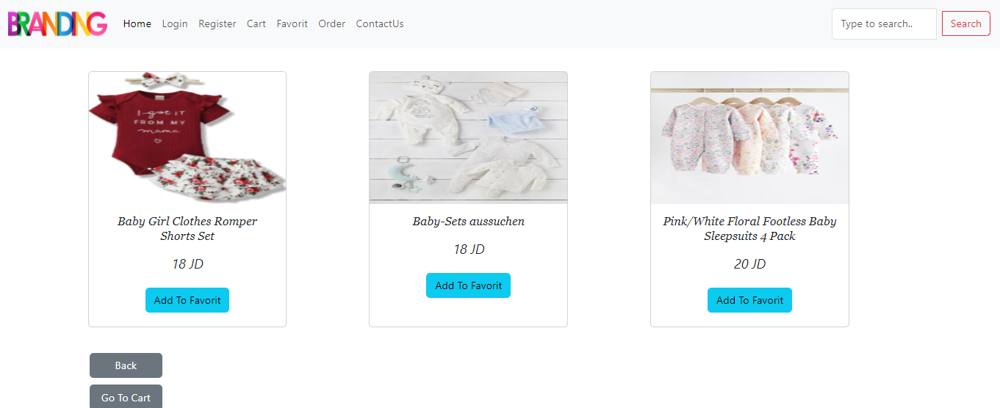
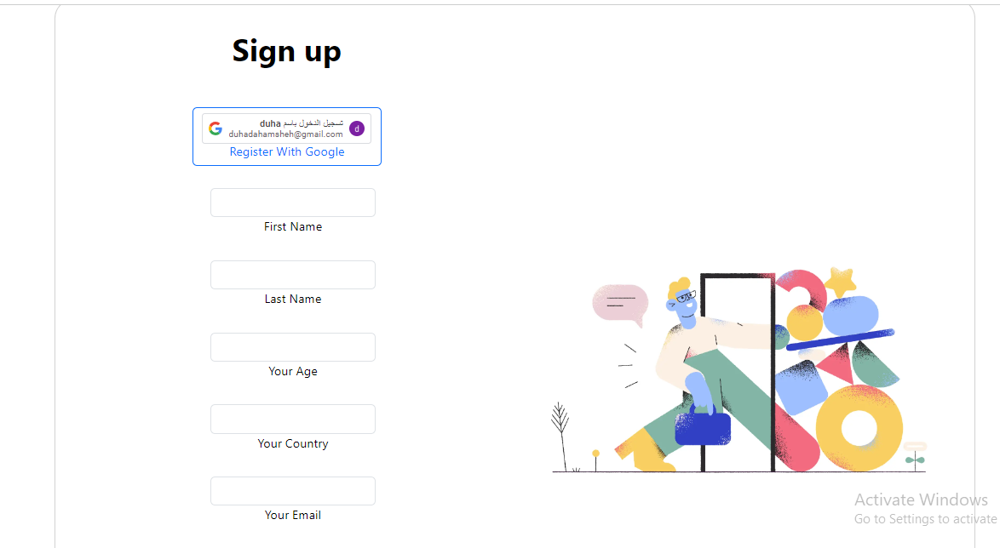
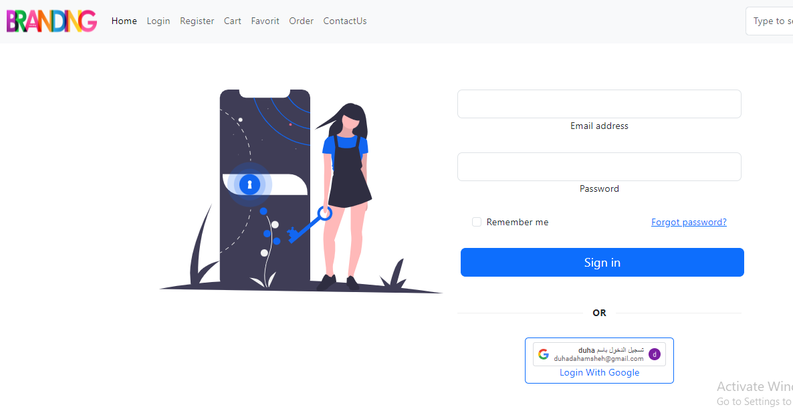
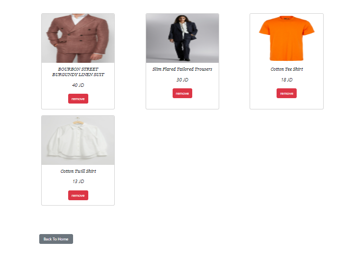
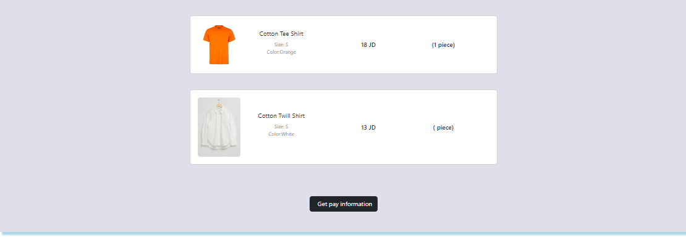
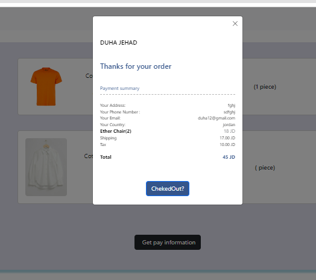

# MERAKI_Academy_Project_4
<p align="center">
<a href="https://www.meraki-academy.org" target="_blank" rel="noopener noreferrer">
 
 </a>
</p>

<h3 align="center">Branding Stor 
</h3>

---

<p align="center"> An awesome Project to describe README 
    <br> 
<a href=''>Demo</a>
    <br> 
</p>

## 📝 Table of Contents

- [About](#about)
- [Getting Started](#getting_started)
- [Usage](#usage)
- [Built Using](#built_using)
- [User Story](#user_story)
- [Data Flow](#data_flow)
- [Guided By](#guided_by)

## 🧐 About 

Hello and welcome to Branding Stor, the place to find the best clothes and jewelry for every taste and occasion. We thoroughly check the quality of our goods, working only with reliable suppliers so that you only receive the best quality product.

We at Branding Shop believe in high quality and exceptional customer service. But most importantly, we believe shopping is a right, not a luxury, so we strive to deliver the best products at the most affordable prices, and ship them to you regardless of where you are located.

## 🏁 Getting Started

These instructions will get you a copy of the project up and running on your local machine for development and testing purposes.

### Prerequisites

- Visual Studio Code follow this <a href='https://code.visualstudio.com/docs/setup/windows'>link </a> to install.
- Git Bash follow this <a href='https://www.atlassian.com/git/tutorials/git-bash'>link </a> to install.
- MongoDB follow this <a href='https://www.mongodb.com/docs/manual/tutorial/install-mongodb-on-windows/'>link </a> to install.
- Node.js follow this <a href='https://nodejs.dev/en/learn/how-to-install-nodejs/'>link </a> to install.

### Installing:

1. Clone the repo to your local machine using git bash.

```
git clone https://github.com/C8-DuhaDahamsheh/MERAKI_Academy_Project_4
```

2. Install packeges repeat this step in backend and frontend folder

```
npm i
```

3. Run server using git bash inside backend folder

```
npm run dev
```

4. Run application using git bash inside frontend folder

```
npm run start
```


Now app ready to use

## 🎈 Usage 

Use this space to show useful examples of how a project can be used. Additional screenshots, code examples and demos work well in this space. You may also link to more resources.

Ex.

- You don't have to register to navigate our web app
  
  
- But you should register if you wont to buy any think from our app
  
  
- You can click on the **Home** tab provided in the navigation bar to view the home section
  
- You can click on the **Add to favorit** button to add this product to your favorit
  
- You can click on the **Add to cart** button to add this product to your cart but you have to be one of our users, so you should create an account
  
- You can click on the **order** after you fill you adress and your phone in cart page to order it
  
  

## ⛏️ Built Using 

- [MongoDB](https://www.mongodb.com/) - Database
- [Express JS](https://expressjs.com/) - Server Framework
- [React JS](https://https://reactjs.org/) - Web Framework
- [Node JS](https://nodejs.org/en/) - Server Environment

## User Story 

Your trello board link
<a href='https://trello.com/b/KZAz1anh/e-commerce-website'>Trello </a>

## Data Flow 

</a>

## ⚠️ Guided By 

This project is guided by ©️ **[MERAKI Academy](https://www.meraki-academy.org)**
